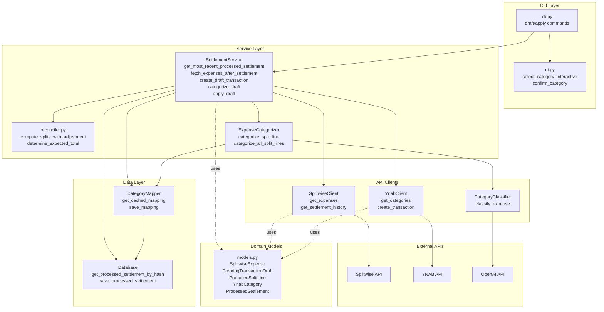

# YnabSplit

Automate YNAB clearing transactions from Splitwise settlements with GPT-powered categorization.

## Problem Statement

Shared expenses tracked in Splitwise are settled periodically via Venmo/bank transfer. The settlement shows up in YNAB as a **single** transaction, but represents many underlying expenses that should be categorized across multiple YNAB categories.

**YnabSplit** automates creation of a **clearing transaction** in YNAB that:
- Has the same total amount/date/payee as the settlement (so bank import matches it later)
- Is a **split transaction** where **one Splitwise expense = one split line** in YNAB
- Correctly allocates category inflows/outflows per expense, while netting to the settlement total
- Uses GPT-4o-mini to intelligently categorize expenses with caching for speed

---

## Quick Start

**1. Install to PATH:**
```bash
git clone https://github.com/codyjk/YnabSplit.git
cd YnabSplit
make              # or: make install
```

**2. Configure:**
Copy `.env.example` to `.env` and add your API keys:
- [Splitwise API key](https://secure.splitwise.com/apps)
- [YNAB access token](https://app.ynab.com/settings/developer)
- [OpenAI API key](https://platform.openai.com/api-keys)

**3. Run:**
```bash
ynab-split draft --categorize --review-all    # Preview (dry-run)
ynab-split apply --categorize --review-all    # Create transaction
```

---

## Usage

### Commands

```bash
ynab-split draft [OPTIONS]    # Preview transaction (dry-run)
ynab-split apply [OPTIONS]    # Create transaction in YNAB
```

**Development:**
```bash
make dev-install    # Install dependencies
make check          # Run linting + type checking
make test           # Run tests
make clear-cache    # Clear category mapping cache
```

### CLI Flags

```bash
ynab-split draft [OPTIONS]
  --categorize, -c       Enable GPT categorization
  --review, -r           Review low-confidence categories
  --review-all           Review ALL categories interactively
  --verbose, -v          Verbose logging

ynab-split apply [OPTIONS]
  --categorize, -c       Enable GPT categorization (default: True)
  --review-all           Review ALL categories interactively
  --yes, -y              Skip confirmation prompt
  --verbose, -v          Verbose logging
```

### Interactive Review

When using `--review-all`:
1. For each expense, you'll see the GPT-suggested category
2. Press `Y` to confirm, `n` to change
3. Type to fuzzy-search categories (e.g., "gro" → "Groceries")
4. Press `Tab` for completions, `Enter` to select, `Ctrl+C` to skip

Manual corrections are cached for future runs.

---

## Architecture

### Project Structure

```
src/ynab_split/
├── cli.py                # Typer CLI with rich formatting
├── service.py            # High-level business logic
├── reconciler.py         # Rounding adjustment algorithm
├── categorizer.py        # Cache-first GPT categorization
├── mapper.py             # SQLite category mapping cache
├── db.py                 # Database layer
├── models.py             # Pydantic domain models
├── ui.py                 # Interactive category selection
└── clients/
    ├── splitwise.py      # Splitwise API client
    ├── ynab.py           # YNAB API client
    └── openai_client.py  # OpenAI GPT-4o-mini wrapper
```

### Component Diagram



### Sequence Diagram: Draft + Apply Flow

```mermaid
sequenceDiagram
    actor User
    participant CLI as cli.py<br/>draft/apply
    participant Service as SettlementService
    participant SW as SplitwiseClient
    participant YNAB as YnabClient
    participant Cat as ExpenseCategorizer
    participant Map as CategoryMapper
    participant GPT as CategoryClassifier
    participant UI as ui.py

    Note over User,UI: SETTLEMENT SELECTION

    User->>+CLI: ynab-split draft --categorize --review-all
    CLI->>+Service: get_recent_settlements(count=3)
    Service->>+SW: get_expenses(group_id, limit=1000)
    SW-->>-Service: expenses[]
    Note over Service: Filter for payment=true, sort by date
    Service-->>-CLI: settlements[3]

    alt Auto-detect (default)
        CLI->>+Service: get_most_recent_processed_settlement(settlements)
        Service->>+YNAB: get transactions since oldest settlement
        YNAB-->>-Service: transactions[]
        Note over Service: Find most recent YS- import_id
        alt Found processed settlement
            Service-->>CLI: settlement (auto-detected)
            Note over CLI: Display "Using most recent processed settlement"
        else First run - no processed settlements
            Service-->>-CLI: None
            Note over CLI: Display "No processed settlements found (first run?)"
            CLI->>+UI: select_settlement_interactive(settlements)
            UI->>User: Show settlement list with YNAB markers
            User-->>UI: Select settlement [1-3]
            UI-->>-CLI: selected_idx
            Note over CLI: selected_settlement = settlements[selected_idx]
        end
    else Manual selection (--manually-select-settlement)
        CLI->>+Service: check_settlements_in_ynab(settlements)
        Service->>YNAB: Check for YS- transactions per settlement
        Service-->>-CLI: already_in_ynab[]
        CLI->>+UI: select_settlement_interactive(settlements, already_in_ynab)
        UI->>User: Show settlement list with ✓ markers
        User-->>UI: Select settlement [1-3]
        UI-->>-CLI: selected_idx
        Note over CLI: selected_settlement = settlements[selected_idx]
    end

    Note over User,UI: FETCH & CREATE DRAFT

    CLI->>+Service: fetch_expenses_after_settlement(settlement)
    Service->>+SW: get_expenses(group_id, dated_after=settlement.date, limit=1000)
    Note over SW: Uses full datetime for filtering
    SW-->>-Service: expenses[]
    Note over Service: Filter out payment=true
    Service-->>-CLI: regular_expenses[]

    CLI->>+Service: create_draft_transaction(expenses)
    Note over Service: compute_splits_with_adjustment()
    Service-->>-CLI: draft

    CLI->>+Service: check_if_already_processed(draft)
    Service->>+YNAB: Check for YS-{hash}-{date} import_id
    YNAB-->>-Service: None
    Service-->>-CLI: False

    Note over CLI,GPT: CATEGORIZATION

    CLI->>+Service: categorize_draft(draft)
    Service->>+YNAB: get_categories(budget_id)
    YNAB-->>-Service: categories[]
    Service->>+Cat: categorize_all_split_lines(draft.split_lines)

    loop For each split line
        Cat->>Map: get_cached_mapping(description)
        alt Cache hit
            Map-->>Cat: cached category
        else Cache miss
            Map-->>Cat: None
            Cat->>+GPT: classify_expense(description, categories)
            Note over GPT: Parallel calls via ThreadPoolExecutor
            GPT-->>-Cat: (category_id, confidence, rationale)
            Cat->>Map: save_mapping(description, category_id, ...)
        end
    end

    Cat-->>-Service: categorized split_lines
    Service-->>-CLI: draft

    Note over CLI,UI: REVIEW (--review-all)

    loop For each split line
        CLI->>+UI: confirm_category(category_id, categories, description)
        UI->>User: Show category, ask Y/n
        alt User rejects
            UI->>UI: select_category_interactive(...)
            UI->>User: Fuzzy search prompt
            User->>UI: Select new category
            UI-->>-CLI: new_category_id
            CLI->>Map: save_mapping(description, new_category_id, source="manual")
        else User accepts
            UI-->>-CLI: confirmed
        end
    end

    CLI->>User: Display draft table
    deactivate CLI

    Note over User,UI: APPLY (ynab-split apply)

    User->>+CLI: ynab-split apply --categorize --review-all
    Note over CLI,YNAB: (Repeat selection + fetch + categorize + review)
    CLI->>User: Display draft, ask confirmation

    CLI->>+Service: apply_draft(draft)
    Service->>+YNAB: create_transaction(budget_id, draft)
    Note over YNAB: Creates split transaction with YS- import_id
    YNAB-->>-Service: transaction_id
    Service-->>-CLI: transaction_id

    CLI->>User: ✓ Transaction created!
    deactivate CLI
```

### Key Components

- **SettlementService**: Orchestrates workflow - auto-detects last processed settlement, fetches expenses after it, creates drafts, categorizes, applies to YNAB
- **Auto-detection**: Finds most recent YS- transaction in YNAB to determine starting point; falls back to manual selection on first run
- **ExpenseCategorizer**: Cache-first categorization with parallel GPT calls via ThreadPoolExecutor (8-10x speedup)
- **Reconciler**: `compute_splits_with_adjustment()` ensures split line totals exactly match settlement amount (exhaustively tested against rounding errors)
- **CategoryMapper**: SQLite-backed cache with confidence tracking - learns from manual corrections
- **Interactive UI**: Fuzzy-searchable category/settlement picker with tab completion using prompt_toolkit

### Database Schema

SQLite database at `~/.ynab_split/ynab_split.db`:

- **`category_mappings`**: Caches expense description → category mappings (description, ynab_category_id, source, confidence)

Auto-detection works by querying YNAB for transactions with `YS-` prefix in import_id (no local state needed).

---

## How It Works

1. **Select Settlement**: Auto-detects most recent processed settlement from YNAB (by finding latest YS- transaction); falls back to manual selection on first run
2. **Fetch Expenses**: Gets ALL expenses from Splitwise after the selected settlement timestamp (no upper bound)
3. **Compute Splits**: For each expense, calculates net amount: `net = paid_share - owed_share`
   - `net > 0`: YNAB inflow (you're owed)
   - `net < 0`: YNAB outflow (you owe)
4. **Categorize**: Checks cache first, then calls GPT-4o-mini in parallel for uncached items
5. **Adjust Rounding**: Ensures split totals exactly equal settlement amount (adjust last line by residual milliunits)
6. **Apply**: Creates YNAB split transaction with deterministic `YS-{hash}-{date}` import_id for idempotency

---

## Development

**Setup:**
```bash
make dev-install    # Install dependencies + pre-commit hooks
```

**Code Quality:**
```bash
make check          # Linting + type checking
make format         # Auto-format code
make test           # Run tests (use -k for specific, --cov for coverage)
```

**Pre-commit hooks** run automatically: ruff linting/formatting, mypy, YAML validation, security checks.

---

## Troubleshooting

**"This settlement was already processed"**
- You've already applied this settlement. Delete the YNAB transaction manually, then:
  ```bash
  sqlite3 ~/.ynab_split/ynab_split.db "DELETE FROM processed_settlements WHERE settlement_date = 'YYYY-MM-DD';"
  ```

**Clear category cache:**
```bash
make clear-cache
```

**Verbose logging:**
```bash
ynab-split draft --verbose  # Shows DEBUG logs including HTTP requests
```

By default, HTTP request logs are hidden. Use `--verbose` to see all network requests to Splitwise, YNAB, and OpenAI APIs.

---

## License

MIT

---

## Credits

Built with: [uv](https://github.com/astral-sh/uv) • [Typer](https://typer.tiangolo.com/) • [Rich](https://rich.readthedocs.io/) • [prompt_toolkit](https://python-prompt-toolkit.readthedocs.io/) • [Pydantic](https://pydantic-docs.helpmanual.io/) • [OpenAI](https://platform.openai.com/)
